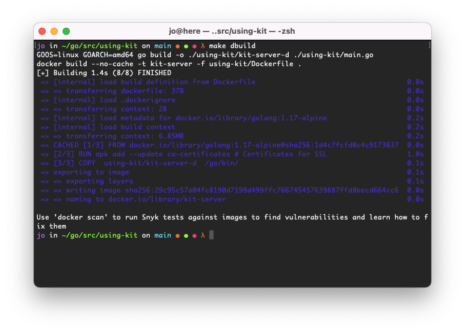
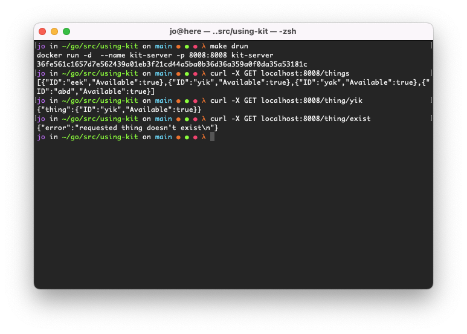
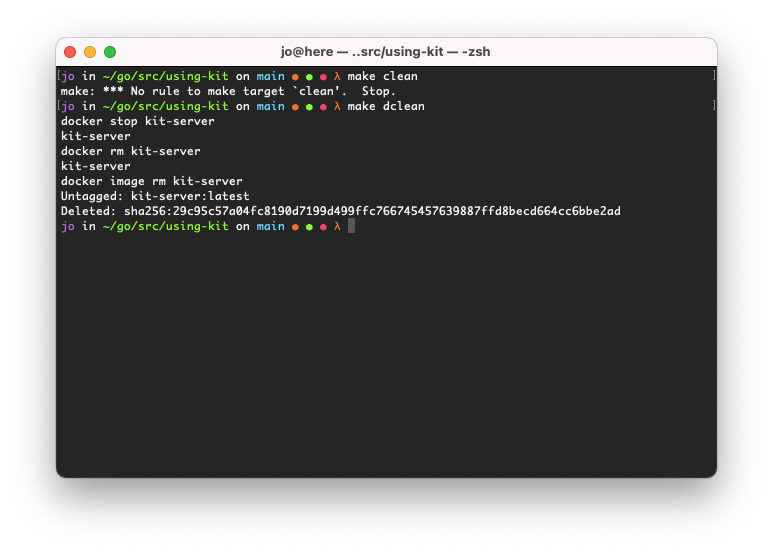
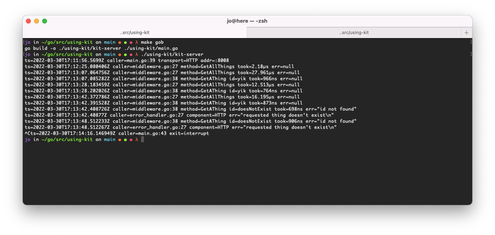

# What is this project?
This project is provided as supplementary material to [this blog post](). The post is an aggregation of
Go history,specifically, the *why* of Go. It aims to provide enough context to begin using go with little/no previously knowledge.
It covers building an http server using the Go standard library. Building on that we create a service that more closely resembles a production
ready microservice.

## How to use it
The project exists inside my go path @ <code>$HOME/go/src/using-kit</code>.
<code>GOPATH=$HOME/go</code>.
<code>GO111MODULE="off"</code>.
Examples of using the kit-server code.

- Using Docker.
- Building a go binary or using the `go run` command.

### With Docker

### As binary

### Go run

