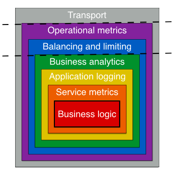

## Using Go & Go kit to build microservices for prod.


Over a series of posts, I'm going to walk through using Go and Go kit. We'll see the service evolve in complexity over time, 
and how Go kit makes building these services easier and boosts developer productivity.  I've spent roughly 5 years using 
these together, in various production environments, on multiple teams. I would describe my time using go kit as the most 
enjoyable & productive time of my career thus far. In this article, we'll take a look at 2 different example servers. 
One is using basic features of kit. The other is another open-source project built on top of kit called Gizmo. 
Gizmo is a more opinionated version of kit server. It comes with what I believe to be some nice abstractions/configuration 
options, but also some bloat.

---
### What is Go kit and why should we consider using it?
From the Kit FAQ^[https://gokit.io/faq/#what-is-go-kit]:
> Go kit is a collection of Go (golang) packages (libraries) that help you build robust, reliable, maintainable microservices.

>Go kit de-risks both Go and microservices by providing mature patterns and idioms, written and maintained by a large
group of experienced contributors, and validated in production environments.

---
### First look at key Go kit concepts.


#### Transport layer
Here you have the flexibility of implementing one or more transports(example HTTP/gRPC). In our example service we
are using HTTP encoding a json response. Which looks something like this: 


```go
	getThingHandler := httptransport.NewServer(
		loggingMiddleware(log.With(logger, "method", "get-a-thing"))(rawkit.GetAThingEP(svc)),
		rawkit.DecodeGetThingRequest,
		httptransport.EncodeJSONResponse,
	)

	r := mux.NewRouter()
	r.Handle("/things/{id:[a-zA-Z]+}", getThingHandler).Methods("GET")
```
1. A few things to note. I'm using a `Mux (gorilla) router`. There are different routers available to you with different 
features/performance available to you.
2. `httptransport.NewServer` Is from the package `github.com/go-kit/kit/transport/http` and it creates a kit.Server 
that wraps an endpoint and implements http.Handler.
3. The Endpoint(which we'll talk about in a second) needs a request decoder & response encoder.
4. GetAThing is a function that is taking in the service we created, and returns an endpoint

#### Endpoints
Endpoint is the fundamental building block of servers and clients. It represents a single RPC method.
Endpoint type is a function that takes in an interface request and returns an interface response. The decoder/encoder
and endpoint func is where your safety and anti-fragile logic will live. 
Which in this example looks like this:
```go

func GetAThingEP(svc ThingSvc) endpoint.Endpoint {
    return func(ctx context.Context, request interface{}) (interface{}, error) {
        req := request.(GetThingRequest)
        v, err := svc.GetAThing(ctx, req.ID)
            if err != nil {
                return GetThingResponse{*v, err.Error()}, nil
            }
            return GetThingResponse{*v, ""}, nil
    }
}
```

#### Services
A service is where your business logic should live. Start by creating an interface with methods that will eventually
wrapped by endpoints and made available at the transport layer (although they don't have to be).

#### Life cycle of the request
(Should I create a quick graphic to show this instead of writing it?)
It depends on your server configuration. Looking again at `kit.Server`

```
type Server struct {
e            endpoint.Endpoint
dec          DecodeRequestFunc
enc          EncodeResponseFunc
before       []RequestFunc
after        []ServerResponseFunc
errorEncoder ErrorEncoder
finalizer    []ServerFinalizerFunc
errorHandler transport.ErrorHandler
}

```
The server struct offers methods to configure the package private fields. Also will depend if you configure any
additional server options. I'm going to exclude mentioning these, but you can click into `kit/transport/http/server.go`
and read the comments.

Serve accepts incoming connections on the Listener l, creating a new service goroutine for each. The service goroutines
read requests and then call srv.Handler to reply to them. In this case that handler is the `mux.router` and it will
match the route if one exists. You can create a catch all handler, or configure a route not found method
like `r.NotFoundHandler = http.NotFoundHandler()`. Assuming we find the route the next stop is the logging middleware
function we created above. (link to function or show it?).

`Middleware->Decoder->Endpoint->Service->ResponseEncoder`


----
Looking at Gizmo

1) Break down high level service interface it provides
2) Explain server configuration options available out of box.
Just contrast with go-kit to show work that's already done for you.


### Next
In the next post we'll deploy this to a few different amazon services (EKS, EC2, & Lambda).


----
### Interesting things not touched
* Why the Request structs/encoder are more useful
    * reuse using with client (from other services or internally)
    * from there, could should client features like internal LB, retry polices,throttling, etc.
* Using protobuff for request/struct generation. Would be used in gRPC transport
* Server timeout settings
* Using goroutines/channels for graceful shutdown and allowing for shutdown tasks in the main function.
* not enough on middleware/using decorator pattern on endpoints/services.


* Should observability/monitoring be included in the deployment article or its own.