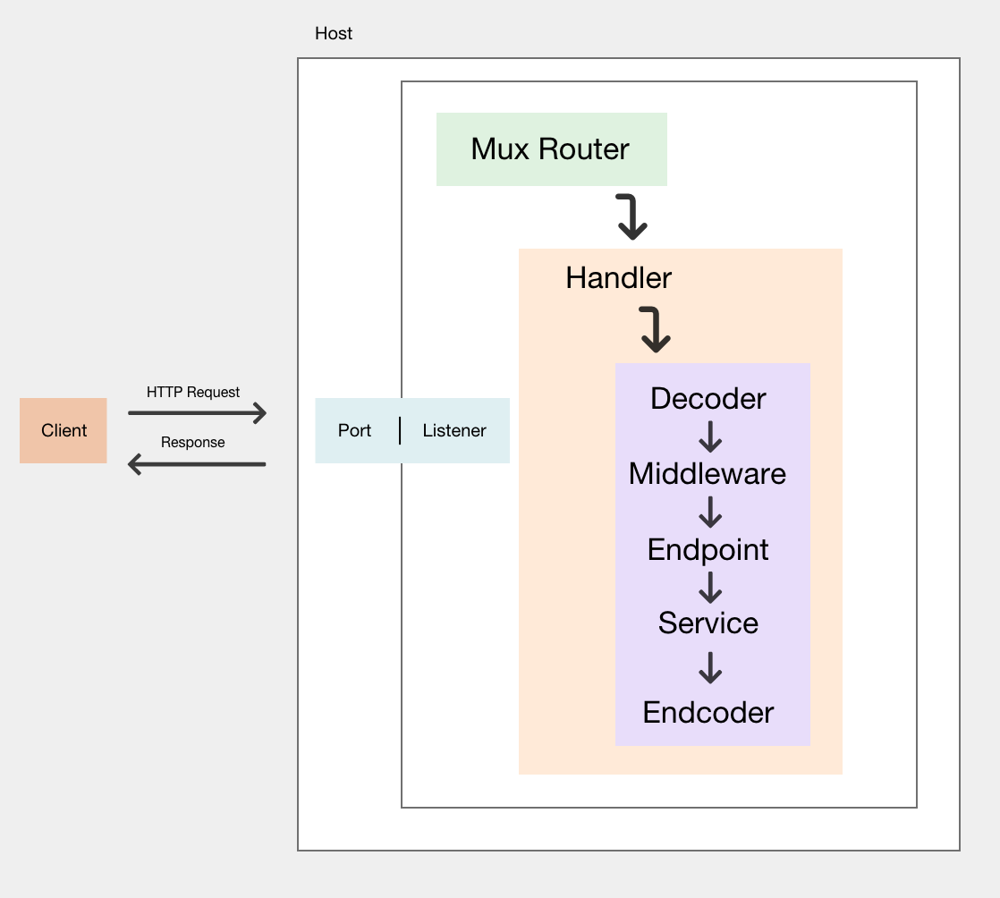

# Why you should be writing your microservices in Go
Keep it simple, stupid. The KISS principle is one of my favorites. Often we are guilty of making systems unnecessarily  complex. This creates a miserable cycle of working with these things that we create. Does it have to be this way?  Go was designed with simplicity & ease of use top of mind. I'm claiming by using Go to build your next server/service  the benefits will go beyond the performance of your software. You will develop software faster, be happier, and maybe even bored with how easy it is to use Go. This will be the first article in a series exploring building systems with Go.   In this post we'll be looking at:
- Origins of Go
- Some language features & design principles
- the `net/http` package from the standard library
- what features we expect in a production ready microservice
- a few iterations/different approaches to building a server
- A standard library approach
- Swapping out the default serveMux (router)
- Go kit approach to organizing our microservice

By the end it is my hope that you will have enough information to accurately assess using Go in your own work. Also,  enough knowledge of Go to confidently build your own service from scratch.

## Origins of Go.
Picking the right tool for the job is important. Go is the language of the cloud, that's building the modern cloud
(i.e. docker, kubernetes). Before Go it didn't seem like any one language existed that checked all the boxes
required for current day development challenges. Why can't we have efficient compilation,
efficient execution, and ease of programming? In a talk from 2012 Rob Pike describes why they created Go for use at Google.
> Go was designed and developed to make working in this environment more productive. Besides its better-known aspects  such as built-in concurrency and garbage collection, Go's design considerations include rigorous dependency management,  the adaptability of software architecture as systems grow, and robustness across the boundaries between components.

A programming language built to deal with the challenges of software engineering? Specifically working with distributed  systems.
Alright, enough of this and lets actually look at some code.

### Quick look at syntax
Go was designed with syntax simplicity and readability in mind. We wanted a feeling of familiarity to existing languages  declaration syntax is closer to Pascal's than to C's. The declared name appears before  the type and there are more keywords:
```
var fn func([]int) int
type T struct { a, b int }
```
Here we declare a function named 'fn' , and a struct of custom type `T`

Here's the same declarations in C.
```
int (*fn)(int[]);
struct T { int a, b; }
```
Declarations introduced by keyword are easier to parse both for people and for computers, and having the type syntax not be the expression syntax as it is in C has a significant effect on parsing: it adds grammar but eliminates ambiguity. But there is a nice side effect, too: for initializing.

Here's an example of explicit vs derived initialization
```
// NewT is a method on type T above that returns a newly create T struct
// a method is just a function with a special receiver, in this case T.
func (t T) NewT(a,b int)(T){
}

var myStruct T = t.newT(val1,val2) //explicit - assuming type T has this method associated with it.
mystruct := t.newT(val1,val2)      //derived
```

To me, Go feels like a dynamically typed language but I'm still getting the benefits and speed of a statically typed,
compiled language.
[More on syntax in Go](https://go.dev/blog/declaration-syntax)


### Interfaces
Interfaces in Go are one of, if no the best feature of the language. Go's interfaces let you use [duck typing](https://en.wikipedia.org/wiki/Duck_typing) like you would in a purely dynamic
language like Python but still have the compiler catch obvious mistakes. Go encourages composition over inheritance,
using simple, often one-method interfaces to define trivial behaviors that serve as clean, comprehensible
boundaries between components.

In the next section we'll see concrete examples of using interfaces and how they relate to building our first server.

[more on composition over inheritance](https://go.dev/talks/2012/splash.article#TOC_15.)
[more on types](https://go.dev/doc/faq#types)

### Building an HTTP server using Go's standard Library.
Go’s true power comes from the fact that the language is small and the standard library is large. It enables newcomers  to ramp up quickly. Why? It limits the number of ways you can do something and has a very opinionated view of the world  at the compiler level. The goal of this section is to not only build our Go http server, but understand the structs and abstractions involved, and how they fit together. We will build off these ideas as we evolve our server.Lets dig into the `net/http` package.

The first piece we'll need is the `Handler` interface.

```
type Handler interface {
ServeHTTP(ResponseWriter, *Request)
}
```

`Handler` is an interface that contains a single method `ServeHTTP`. `ServeHTTP` takes 2 values
1. `ResponseWriter` which is an interface is used by an HTTP handler to construct an HTTP response.
2. A pointer to an `http.Request` struct.

We'll look at the Request and Response objects in more detail in a bit. We'll work each of them often.
Now lets build a handler knowing what we know about Go types and interfaces.

```
type MyFirstHandler struct{}

func (g MyFirstHandler) ServeHTTP(w http.ResponseWriter, r *http.Request) {
fmt.Println("MyFirstHandler type implements http.Handler")
}

func main() {
var handler MyFirstHandler


// ListenAndServe listens on the TCP network address addr and then calls
// Serve with handler to handle requests on incoming connections.
// Accepted connections are configured to enable TCP keep-alives.
//
// The handler is typically nil, in which case the DefaultServeMux is used.
//
// ListenAndServe always returns a non-nil error.
//ListenAndServer func signature -- ListenAndServe(addr string, handler Handler) error
err := http.ListenAndServe(":8833",handler)
if err != nil {
fmt.Println("error while attempting to listen for incoming connections", err)
}
}

//main.go
```

Lets break this down a bit. `ListenAndServer` tells our app to listen on a specific port/network address that we provide.  The second parameter is our handler. If you read the comment above you'll see that http library provides us with a default  handler - `DefaultServeMux` if we do not provide our own. What is a ServeMux?
From the standard library comments:

```
// ServeMux is an HTTP request multiplexer.
// It matches the URL of each incoming request against a list of registered
// patterns and calls the handler for the pattern that
// most closely matches the URL.
```
Still ServeMux? Handler?
* If you've ever used an http framework in another language that leveraged an MVC-pattern, handlers are similar to controllers. They perform your application logic & write response information (headers, body, etc).
* servemux is also referred to as a router. There are additional [routers available]((https://benhoyt.com/writings/go-routing/) ) to you outside of the standard library. Primary function of a router is to store a mapping between url paths and their handlers that we define. Router features, and implementation will vary, but they all implement `ServeHTTP` interface.

[benchmarks for routers](https://github.com/julienschmidt/go-http-routing-benchmark)

Lets reshuffle our example a bit.

```
func (g MyFirstHandler) ServeHTTP(w http.ResponseWriter, r *http.Request) {
tm := time.Now().Format(time.RFC3339)
w.Write([]byte("The time is: " + tm))

}

func main() {
var firstHandler MyFirstHandler

// declare our serveMux in main
router :=http.NewServeMux()
// register handler we defined - it now responds to any request to path use-handler
router.Handle("/use-handler", firstHandler)

err := http.ListenAndServe(":8833", router)
if err != nil {
fmt.Println("error while attempting to listen for incoming connections", err)
}
}

//main.go
```
What's changed?

* We've edited the handler to return the current time instead of printing a static string.
* Declaring a serveMux aka router in our main function.
* Register our handler to a specific route "/use-handler"

Now lets really start to build this thing up. We mentioned earlier that there are a bunch of routers
available to us and now we're going to use one. This new router gives us a convenient method for setting named path   parameters & helper function for accessing them.

Here's what it looks like:

```
import (
"fmt"
"net/http"
"time"

"github.com/gorilla/mux"
)


type MyFirstHandler struct{}

func (g MyFirstHandler) ServeHTTP(w http.ResponseWriter, r *http.Request) {
//get URL path param name from the request
name := mux.Vars(r)["name"]
tm := time.Now().Format(time.RFC3339)
w.Write([]byte(fmt.Sprintf("Hello %s, the time is: %s\n", name, tm)))
}
//main.go
```

For the first time we are importing a package outside the standard library. We're now using the [gorilla/mux](https://github.com/gorilla/mux#readme).
We also use the `mux.Vars`  helper function which takes the route params and puts them in a map for us to access.

Here's the updated route:
```
router.Handle("/use-handler/{name:[a-zA-Z]+}", firstHandler).Methods("GET")

//main.go
```
We set the allowable http verb for this route with `.METHODS("GET")`,set expected route param value, and naming it name.  I think we're ready to turn this into a real service.


## Intro to Go kit
In this section, we'll talk about Go-kit,  which I'll refer to as kit for the rest of this post.
### What is *kit* and why should I use it?
In their own words:
> kit is a collection of Go (golang) packages (libraries) that help you build robust, reliable, maintainable microservices.
>You should use kit if you know you want to adopt the microservices pattern in your organization. Go kit will help you structure and build out your services, avoid common pitfalls, and write code that grows with grace. Go kit de-risks both Go and microservices by providing mature patterns and idioms, written and maintained by a large group of experienced contributors, and validated in production environments.
We won't dive into all things Kit here, but lets take a look at how Kit gives us a template for structuring our service logic.



Taking a look at this diagram there's some similar pieces to our original simple server implementation. Everything but whats in the purple box.
The major benefit of *kit* is that it provides a some nice abstractions to structure your service in 3 layers.
1. Transport layer
2. Endpoint layer
3. Service layer

#### Transport layer
Here you have the flexibility of implementing one or more transports(example HTTP/gRPC). In our example service we
are using HTTP encoding a json response. The following code is defined in rawkit/server/main.go in our project & we'll look at
that first.

In this example we won't explore the benefits of multiple transports, but deal only with HTTP & JSON.


```go
svc := rawkit.NewThingSvc(logger)

getThingHandler := httptransport.NewServer(
loggingMiddleware(log.With(logger, "method", "get-a-thing"))(rawkit.GetAThingEP(svc)),
rawkit.DecodeGetThingRequest,
httptransport.EncodeJSONResponse,
)

r := mux.NewRouter()
r.Handle("/things/{id:[a-zA-Z]+}", getThingHandler).Methods("GET")

http.ListenAndServe(DEFAULT_PORT, r)
// using-kit/server/main.go
```

Breaking down our new main function:

1. Again we are using the same `gorilla/mux` setup for our router.
2. `httptransport.NewServer` is from the package `github.com/go-kit/kit/transport/http` and it creates a kit.Server
that wraps an endpoint, a decoder for the request, and the `kit/transport/http.Server` type implements http.Handler.

Lets peel this back another level and look at the Endpoint function, decoder & encoders that live inside this server wrapper
provided to us by the kit package.

`Endpoint` is the fundamental building block of servers and clients. It represents a single RPC method.
Endpoint type is a function that takes in an interface request and returns an interface response. The decoder/encoder
and endpoint func is where your safety and anti-fragile logic will live. Looking back to our simple server example
we interact with ` w http.ResponseWriter & r *http.Request` types and we will again here. The first stop on the request path
is our decoder.

```go
func DecodeGetThingRequest(_ context.Context, r *http.Request) (interface{}, error) {
var req GetThingRequest
req.ID = mux.Vars(r)["id"]
if len(req.ID) == 0 {
return nil, errors.New("missing ID route param")
}
return req, nil
}
```
What should go inside a decoder function and what's it doing?
- Here we interact with an `http.Request` struct just like our simple server handlers. The goal is to convert this into a different request struct that our
underlying service(s) expect.
    - This abstracts away the http transport bit and is a point where we can switch easily for something else if needed.
- Here we interact with http.Request object. Taking it and converting the request into a struct that our service will interact with going forward.
- We also validate the request. Deserializing the payload body(if it was a post/put request). In this case it's a get request. We grab the route parameter 'id' which is a string, and we confirm that it's not an empty string.

This is a good place for any type of validation and conversion or types we expect to work with.

[kit-faq](https://gokit.io/faq/#what-is-go-kit)
[kit-examples](https://github.com/go-kit/examples)